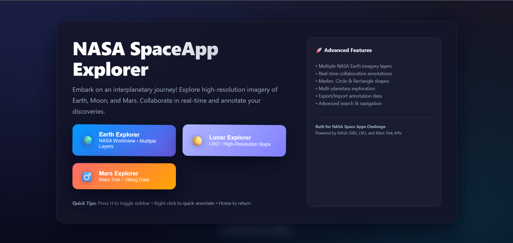
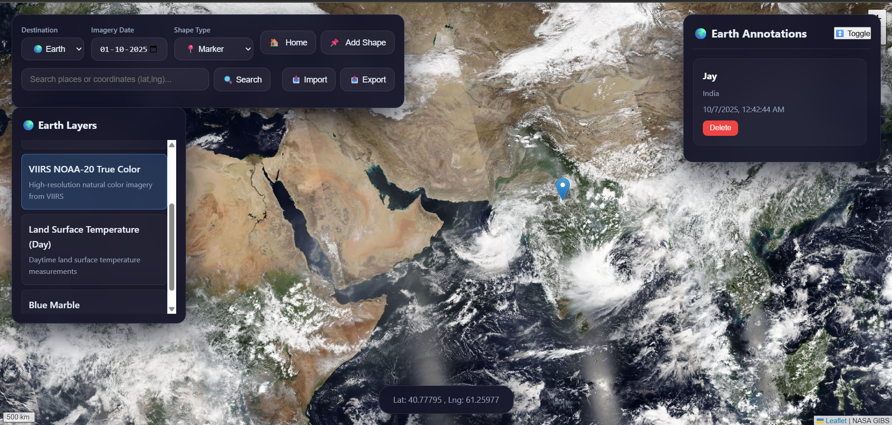
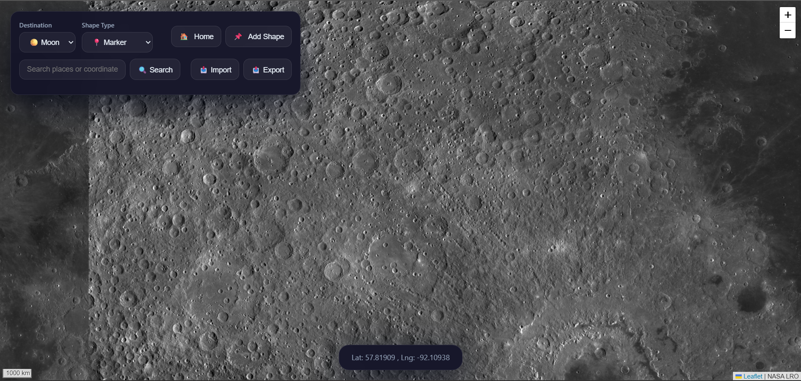
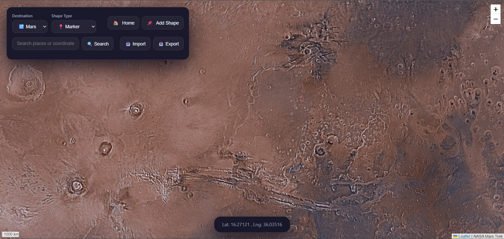

# 🌌 SpectralVision  
### “Explore, Annotate, and Learn from NASA’s Gigapixel Earth, Moon, and Mars Imagery”

---

## 🚀 Live Demo  
🔗 **[SpectralVision — Hosted: https://spectralvision-main.onrender.com/](https://spectralvision-main.onrender.com/)**

---

## 🖼️ Project Screenshots

| Home Page | Earth View | Moon View | Mars View |
|:----------:|:-----------:|:----------:|:----------:|
|  |  |  |  |

---

## 🧭 About the Project
**SpectralVision** is a full-stack interactive mapping platform built for the **NASA Space Apps Challenge 2025**.  
It lets users explore **Earth**, **Moon**, and **Mars** through real NASA imagery, annotate features, and collaborate in real time — bridging the gap between **education and scientific research**.

---

## 🌍 Key Features

### 🪐 Multi-Planetary Exploration
- Explore **Earth**, **Moon**, and **Mars** through NASA’s official datasets  
- High-resolution imagery via **NASA GIBS**, **LRO**, and **Mars Trek** APIs  
- Real-time layer switching across celestial bodies

### 🗺️ Earth Features
- 5 NASA imagery layers:
  - VIIRS SNPP True Color  
  - MODIS Terra True Color  
  - VIIRS NOAA-20 True Color  
  - Land Surface Temperature  
  - Blue Marble Global Mosaic  
- Date-based imagery selection for studying seasonal and temporal changes

### 🌕 Moon & ♂️ Mars Features
- Lunar Reconnaissance Orbiter (LRO) data for detailed lunar maps  
- Viking imagery and Mars Trek datasets  
- Crater and topography exploration

---

## 📍 Annotation & Collaboration
- Multiple shape types: Marker, Circle, Rectangle  
- Real-time multi-user annotation updates (via **Socket.IO**)  
- Persistent **SQLite** storage  
- Import/Export JSON annotation data  
- Instant **delete and edit functionality**  
- Conflict-free data synchronization across users  

---

## 💬 Real-Time Functionality
- **Live multi-user collaboration**  
- **Instant annotation broadcast** via WebSockets  
- **Toast notifications** for all actions  
- **Activity feed** for monitoring real-time updates  

---

## 🎨 User Interface & Experience
- Clean **dark cosmic theme**  
- Fully **responsive design** (mobile, tablet, and desktop)  
- **Animated landing page** with particle effects  
- **Keyboard shortcuts**:
  - `H` → Toggle Sidebar  
  - `Esc` → Cancel Drawing  
- **Coordinate HUD** and quick annotation via right-click  
- **Search by coordinates or location name**  
- **Return Home** button for resetting view  

---

## 🌐 Deployment
**Live Website:**  
🔗 [https://spectralvision-main.onrender.com/](https://spectralvision-main.onrender.com/)

**Tech Used:** Node.js + Express + SQLite + Socket.IO + Leaflet.js  

---

## 🔧 Technical Overview

| Category | Technology |
|-----------|-------------|
| **Frontend** | HTML5, CSS3, JavaScript (Leaflet.js, Socket.IO) |
| **Backend** | Node.js, Express.js |
| **Database** | SQLite |
| **Real-time Communication** | Socket.IO |
| **APIs Used** | NASA GIBS, LRO Data, Mars Trek API |
| **Deployment** | Render |
| **Version Control** | Git + GitHub |

---

## 💾 Data Management
- Persistent **SQLite** storage for annotations  
- Import/export data in `.json` format  
- Automatic backup & merging for conflict-free collaboration  
- Real-time updates reflected instantly for all connected users  

---

## 🧩 Installation & Local Setup

### Run Locally
```bash
# 1️⃣ Clone this repository
git clone https://github.com/CoderJay10/SpectralVision-Main.git

# 2️⃣ Navigate to the project directory
cd SpectralVision-Main

# 3️⃣ Install dependencies
npm install

# 4️⃣ (Optional) Fix any audit issues
npm audit fix --force

# 5️⃣ Start the server
npm start

# 6️⃣ Open in your browser
http://localhost:8000
```

---

## 👩‍🚀 Contributors

| Name | Role |
|------|------|
| **Jay Bhusari** | Full-Stack Developer & Project Lead |
| **Saul Patil** | Data Specialist — Managing NASA Datasets & Resources |
